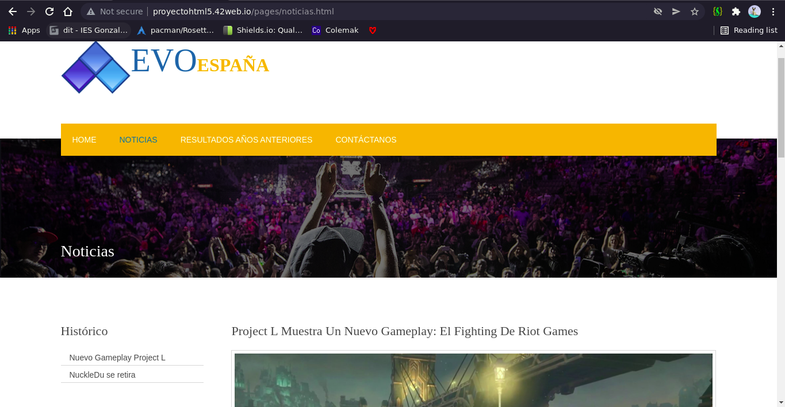

# Proyecto HTML5 y CSS
## Plantilla
La plantilla utilizada es: 
[https://www.free-css.com/free-css-templates/page260/surogou](https://www.free-css.com/free-css-templates/page260/surogou)

## Hosting
La opción de hosting utilizada ha sido 
[https://app.infinityfree.net/](https://app.infinityfree.net/)

Ya que tiene servicio de hosting gratuito, Además de la opción de utilizar un servidor FTP para la transferencia de archivos.

La url en la que está alojada la página es:
[http://proyectohtml5.42web.io/](http://proyectohtml5.42web.io/)
## Capturas de las páginas:

## Subida de archivos al hosting
se ha hecho mediante el cliente de ftp FileZilla, a través de la dirección indicada por el hosting

he tenido que subir los archivos a la carpeta htdocs, dentro del directorio raíz.
## Validación
Todos los html son válidos, sin embargo, al validar en la url del hosting, aparecen errores que no existen:

Html de la pagina inicio validado

Misma página con el html indicado pero con errores